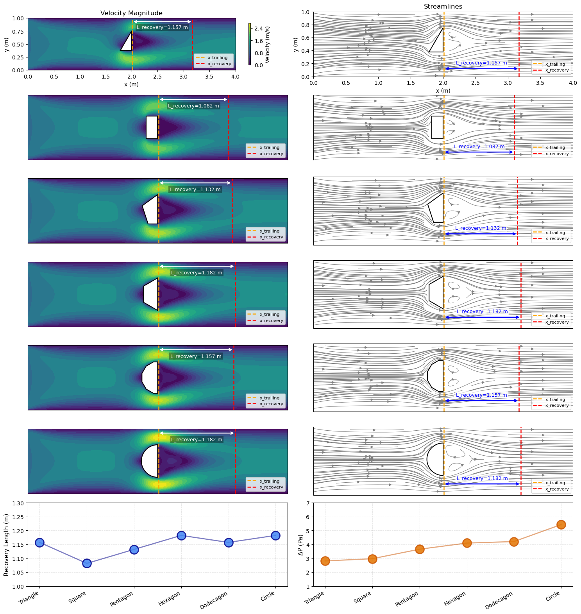
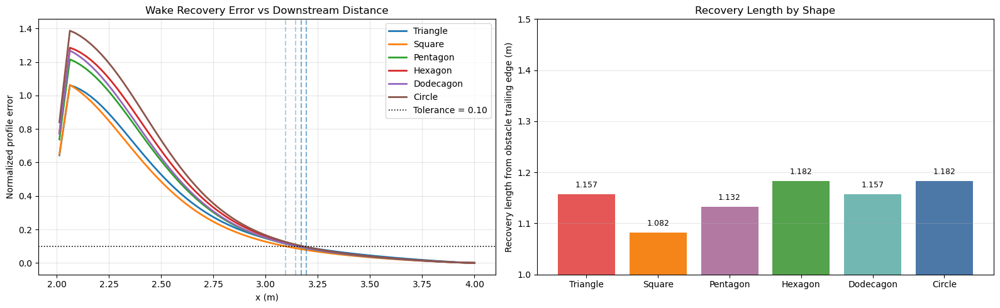
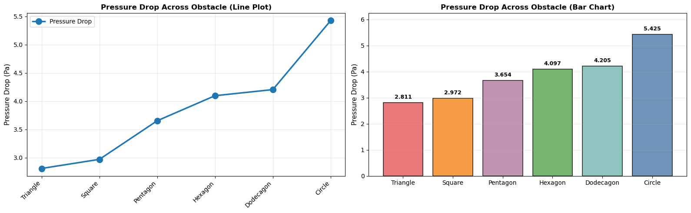

# Channel Obstacle CFD (NVIDIA Warp)

A 2D incompressible CFD study of channel flow around six obstacle geometries (triangle, square, pentagon, hexagon, dodecagon, circle), implemented in NVIDIA Warp.

## Poster Figure (Final Notebook Visualization)



## Visualization Results

### 1) Wake recovery trends and recovery length comparison



### 2) Pressure-drop comparison



### 3) Full multi-panel CFD summary (poster)


## Notebook

- `rectangle.ipynb`

## Problem Setup

- Domain: 4.0 m x 1.0 m
- Grid: 160 x 40
- Inlet velocity: 1.0 m/s
- Density: 1.0 kg/m^3
- Dynamic viscosity: 0.02 Pa.s
- Reynolds number: 50
- Obstacle center: (2.0, 0.5)
- Obstacle circumradius: 0.25 m

## Numerical Method

Fractional-step projection per pseudo-time step:
1. Advection-diffusion to compute intermediate velocity
2. Pressure Poisson solve
3. Velocity correction using pressure gradients

Warp kernels are used for boundary conditions, pressure BCs, advection-diffusion, pressure Poisson iteration, and velocity correction.

## Key Metrics

- Recovery profile error:

$$
E(x_i)=\frac{\sqrt{\left\langle (u(x_i,y)-u_{out}(y))^2 + (v(x_i,y)-v_{out}(y))^2 \right\rangle_y}}{U_{inlet}}
$$

- Pressure drop:

$$
\Delta P = p(x=0, y=H/2) - p(x=L, y=H/2)
$$

## Environment

- Python 3.10+
- warp-lang
- numpy
- matplotlib
- jupyter

```bash
conda create -n warp-cfd python=3.10 -y
conda activate warp-cfd
pip install warp-lang numpy matplotlib jupyter
```

## Run

1. Open `rectangle.ipynb` in VS Code or Jupyter.
2. Run all cells from top to bottom.
3. Review the visualization outputs and shape-wise metrics.

## Suggested Public Repository Name

`channel-obstacle-cfd-warp`

This name directly reflects the notebook scope and method.
